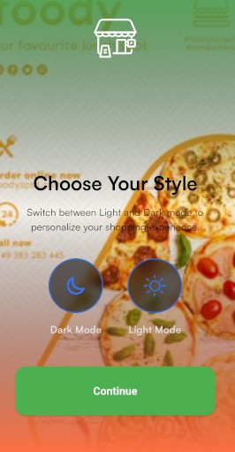
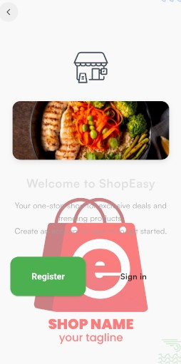
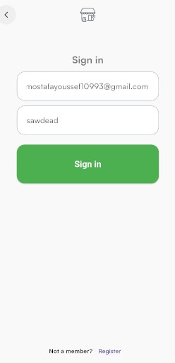
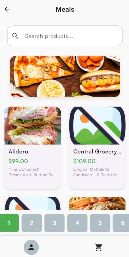
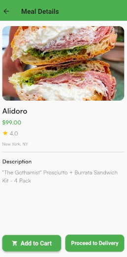
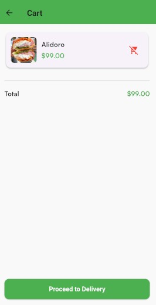
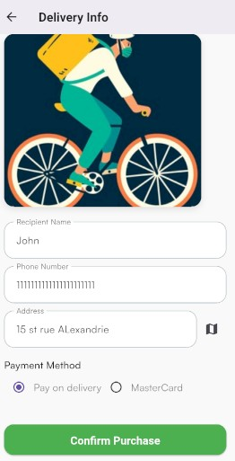
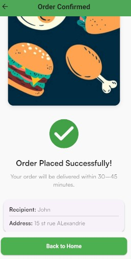

# FastFood — Flutter Food Delivery App

**FastFood** is a simple fast-food delivery demo app built with **Flutter** following **Clean Architecture** principles.  
It demonstrates a complete installable app flow: splash → onboarding → theme selection → authentication → meals list (from local JSON) → meal details → add to cart → checkout → delivery data entry → confirmation.

> Note: Authentication uses **Firebase Authentication**. User data (profiles) are stored in **Supabase**. Meal catalogue is a local JSON file under `assets/` for easy editing and offline testing.

---

## Key Features

- Splash screen and onboarding.
- Theme chooser (light/dark or custom themes).
- Sign up / Sign in using **Firebase Auth**.
- Users metadata stored on **Supabase** (e.g., profile details).
- Meals list loaded from `assets/meals.json`.
- Search bar (local search over the JSON data).
- Meal details page with **Add to Cart**.
- Cart page and purchase flow:
  - Enter delivery info (recipient name, phone, address).
  - Confirm purchase → order confirmation page.
- Clean Architecture (presentation / domain / data).
- State management via your preferred approach (e.g., Bloc / Provider / Riverpod) — replace in README with whichever you used.

---

## Tech Stack

- Flutter & Dart  
- Firebase Authentication (email/password, or other providers you configured)  
- Supabase (users database)  
- Local JSON for meals: `assets/meals.json`  
- Clean Architecture (Layers: presentation, domain, data)  
- State management: *(specify: e.g., flutter_bloc)*  
- Persistence for cart (optional): shared_preferences / local DB

---

## Project Structure (example)

lib/
├─ core/ # app-wide utilities, constants, theme
├─ data/
│ ├─ models/
│ ├─ repositories/
│ └─ datasources/
├─ domain/
│ ├─ entities/
│ └─ usecases/
├─ presentation/
│ ├─ pages/
│ ├─ widgets/
│ └─ blocs/ (or providers)
assets/
├─ meals.json
└─ images/

yaml
Copy code

---

## Setup / Run Locally

### Prerequisites
- Flutter SDK installed (stable channel).  
- Firebase project and `google-services.json` (Android) / `GoogleService-Info.plist` (iOS) configured.  
- Supabase project and API keys (URL and anon/public key).

### Steps
1. Clone repository:

Copy environment files / set secrets:

Add Firebase config files to the respective platform folders (see Firebase docs).

Create .env or use lib/core/config.dart to insert Supabase keys:

env
Copy code
SUPABASE_URL=your-supabase-url
SUPABASE_KEY=your-supabase-anon-key
Install dependencies:

bash
Copy code
flutter pub get
Ensure assets are declared in pubspec.yaml:

yaml
Copy code
assets:
  - assets/meals.json
  - assets/images/
Run the app:

bash
Copy code
flutter run
Meals JSON (example)
assets/meals.json contains the entire meals catalogue. 
Example structure:json
Copy code
[
  {
    "id": "meal_001",
    "title": "Cheesy Burger",
    "description": "Beef patty with melted cheese and special sauce",
    "price": 4.99,
    "image": "assets/images/cheesy_burger.png",
    "category": "burgers"
  },
  ...
]
To update the list, edit the JSON and restart the app (hot-reload may work for some changes).

Authentication & Users
Authentication: Firebase Authentication (email/password).

After signup/signin, the app writes/reads user profile data to/from Supabase users table (e.g., id, name, phone, address) — this separates auth (Firebase) from user metadata (Supabase).

Make sure your Supabase table schema matches the fields used by the app.

Clean Architecture Notes
Presentation: UI, pages, blocs/providers.

Domain: Entities (Meal, User, Order), Use Cases (GetMeals, AddToCart, Checkout).

Data: Repositories & DataSources (local JSON loader, remote user DB via Supabase, auth via Firebase).

This separation makes unit testing use cases and repositories straightforward.

Testing
Unit tests for domain use-cases and repository logic.

Widget tests for key screens (meal list, cart, checkout).

Add tests under /test and run:

bash
Copy code
flutter test
Notes & Todos
Payment integration is mocked (no real payments).

Orders are locally confirmed — add server-side order persistence if needed.

Optionally add caching for meal images and better offline support.

## 📸 Screenshots

### Splash & Onboarding
 

### Theme & Authentication
 

### Meals & Search
 

### Meal Details & Cart
 

### Checkout & Confirmation

